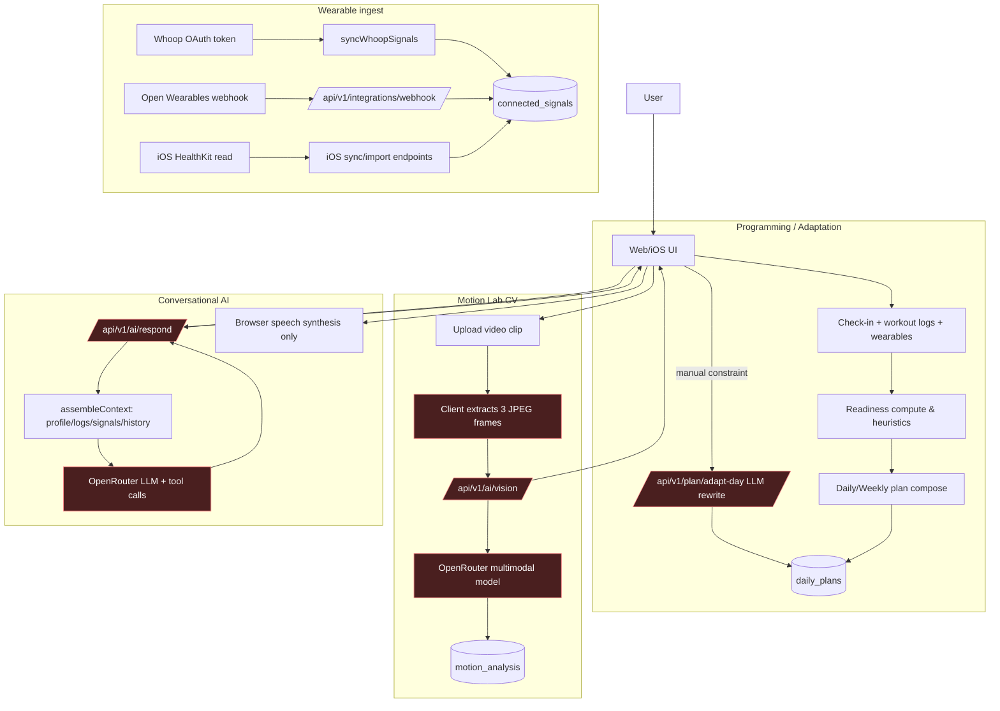

# AskKodaAI vs Super Intelligent Trainer (SIT) Gap Audit

Date: 2026-03-09  
Scope: Web (`app/**`, `lib/**`), iOS (`ios/AskKodaAI/**`), Supabase integration patterns and AI endpoints.

## Executive snapshot

AskKodaAI already has meaningful foundations: workload-informed readiness scoring, adaptive plan generators, wearable ingestion endpoints, and multimodal AI surfaces. The current architecture is **not yet SIT-grade** in three critical ways:

1. **Training adaptation is mostly heuristic or prompt-driven, not tightly closed-loop** (no deterministic day-of rewrite gate keyed to objective fatigue thresholds).
2. **Computer vision is asynchronous clip analysis, not low-latency on-device correction** (no 24fps+ pose stream, no VBT/bar-speed channel).
3. **Voice + memory are not full-duplex and not injury-state transactional** (memory exists, but no deterministic symptom-triggered exercise substitution pipeline).

---

## Pillar-by-pillar technical audit

### Pillar 1 — Algorithmic Programming & Auto-Regulation ("Brain")

#### What exists now
- Readiness uses an ACWR-style model in `calculateReadiness` with explicit danger-zone handling (`acwr > 1.5` reduces readiness sharply).  
- Daily and weekly plans downshift intensity/volume from sleep/energy/soreness trends.  
- There are two adaptation paths:
  - deterministic rules (`lib/plan/adapt-session.ts`) for pain flags/body-region avoidance/intensity preference.
  - LLM rewrite (`/api/v1/plan/adapt-day`) that rewrites exercise JSON using user free text.

#### SIT gap
- **No hard ACWR intervention engine**: ACWR is used for scoring/insight but there is no deterministic rule like "if ACWR>1.5 + CNS fatigue note, auto-mutate today plan before user prompt."  
- **Adapt-day is prompt-driven and user-initiated**: no autonomous rewrite triggered by biometrics/check-in anomalies.
- **Potential payload mismatch risk (iOS → adapt-day)**: iOS sends simplified fields (`minutesAvailable`, `location`, etc.), while route requires `userMessage`, `current_exercises`, etc.; this can degrade adaptation fidelity if backend does not normalize payload variants.

#### Hallucination / safety risk
- LLM-generated exercise arrays are parsed and shape-constrained, but **exercise validity and loading progression are not fully validated against a strict ontology + max-jump constraints**.

---

### Pillar 2 — Low-Latency CV ("Eyes")

#### What exists now
- Motion analysis is currently: user uploads video → client extracts 3 frames → server sends to multimodal LLM (`/api/v1/ai/vision`) → returns score/critique/correction.
- Reliability object and limitations are returned to reduce overconfidence.

#### SIT gap
- **Not on-device real-time inference** (no MediaPipe/YOLO runtime loop in client/iOS).
- **No latency envelope guarantees** (<200ms), no FPS control path, no realtime cue stream.
- **No explicit joint-angle computation engine** (e.g., elbow flexion threshold logic).
- **No VBT signal extraction** (bar path velocity/concentric speed not modeled).
- **Occlusion handling is passive** (limited to reliability disclaimers; no multi-view/temporal tracking fallback).

#### Hallucination / safety risk
- CV output is model-generated critique from sparse frames; this can miss dynamic faults or generate confident but incomplete recommendations.

---

### Pillar 3 — Conversational UX & Cognitive Memory ("Voice")

#### What exists now
- AI chat assembles a rich system prompt from profile, workouts, nutrition, check-ins, wearables, PRs, motion analyses, and recent conversation summary/history.
- There is browser speech synthesis support (`CoachVoiceEngine`) for TTS playback.

#### SIT gap
- **No full-duplex voice loop** (no streaming ASR + realtime LLM + interruptible TTS).
- **No dedicated long-horizon injury state machine**: injury context is included in prompts, but no deterministic "symptom recurrence => auto-swap specific lifts" policy engine.
- **Exercise naming consistency is partially handled** (normalization exists), but no canonical, versioned exercise ontology with alias graph and contraindication map for safe substitutions.

#### Hallucination / safety risk
- Prompt-context memory can surface prior issues, but final substitution behavior remains model-dependent without hard policy execution.

---

### Pillar 4 — Wearable Integration ("Nervous System")

#### What exists now
- Whoop sync helper and Open Wearables webhook ingest sleep/readiness/activity/body event shapes into `connected_signals`.
- Apple Health parsing/import supports weight, sleep, steps (web parser) and iOS HealthKit sync reads weight/sleep/steps/HR.
- Readiness insights include latest wearable metrics in LLM context.

#### SIT gap
- **Integration depth is still moderate**:
  - no first-class Oura ingestion path observed.
  - no robust cross-provider normalization layer that computes canonical readiness features with confidence weighting by source quality.
- **Mutation coupling is weak**: wearable metrics are used in insights and some planning heuristics, but there is no explicit centralized Readiness Orchestrator that deterministically mutates set/rep/intensity prescriptions by wearable deltas.
- **Sync architecture appears mostly request/webhook based**, without clearly defined periodic reconciliation jobs + drift/error budgets per provider.

---

### Pillar 5 — Safety Protocols & Injury Prevention

#### What exists now
- Safety messaging is present in prompts and plan outputs.
- Deterministic adapt-session has body-region exclusion and conservative replacements.
- AI reliability metadata is used in vision/body-comp/nutrition surfaces.

#### SIT gap
- **No hard physiological guardrails layer** enforcing constraints such as:
  - max weekly volume progression per movement pattern,
  - max intensity increase by training age,
  - improbable 1RM anomaly detection and quarantine.
- **No explicit clinical red-flag policy graph** beyond textual safety instructions.
- **No machine-checkable prescription validator** that blocks unsafe LLM outputs before persistence.

#### Critical failure points
1. LLM plan rewrite could output aggressive prescriptions without deterministic caps.  
2. Entered PR/1RM anomalies are not formally sanity-checked against user profile/training history before informing progression.  
3. Vision recommendations may be treated as authoritative despite sparse frame evidence.

---

## Architecture Gap Matrix

| SIT Pillar | Current AskKodaAI implementation | SIT ideal target | Technical complexity to build |
|---|---|---|---|
| Algorithmic Programming & Auto-Regulation | ACWR-style readiness scoring, heuristic downshifts, user-triggered LLM adapt-day + rule-based adapt-session | Deterministic daily auto-regulation engine auto-mutates plan JSON from biometrics + subjective fatigue + objective load risk | **High** (new orchestration service, policy DSL, simulation tests, migration of planning contracts) |
| Low-Latency CV | 3-frame clip sampling + server-side multimodal critique | On-device pose/VBT pipeline at >24fps with <200ms coaching cues and occlusion recovery | **Very High** (mobile inference stack, temporal model, edge optimization, QA rigs) |
| Conversational Voice + Memory | Rich context assembly + text chat + browser TTS | Full-duplex realtime voice agent with persistent injury timeline and deterministic exercise substitution hooks | **High** (streaming infra, interruption control, memory graph, safety middleware) |
| Wearable Nervous System | Whoop + Open Wearables ingest; Apple Health import/sync; signals included in insights | Unified multi-provider schema (Whoop/Oura/HealthKit), confidence-scored normalization, policy-driven training mutation | **Medium-High** (data contracts, jobs, normalization + QA) |
| Safety & Injury Prevention | Safety prompts, rule-based swap constraints, reliability metadata | Hard guardrail engine + prescription validator + anomaly detection + escalation workflow | **High** (policy engine, validator runtime, red-team harness, governance tooling) |

---

## Latency & Data-Flow Diagram (current vs bottlenecks)

### Primary bottlenecks
- CV path is dominated by upload + frame extraction + network + LLM latency; cannot satisfy realtime corrective coaching.
- Voice path is request/response HTTP and non-streaming TTS; no interruption-safe duplex loop.
- Adapt-day depends on remote LLM completion and JSON parse quality; no deterministic pre-commit validator.

---

## The Roadmap (phased sprint plan)

### Phase 0 (1-2 sprints): Safety + Contract hardening (must-do before growth)
- Build a **Prescription Validator** service that enforces:
  - max weekly set/tonnage deltas per movement class,
  - max intensity progression by experience/training age,
  - contraindication map (injuries/symptoms → banned movement families).
- Add **1RM anomaly detection** (z-score + rule thresholds using bodyweight, sex, training age, historical trend).
- Convert adapt-day output into `LLM draft -> validator -> accepted/rejected + auto-corrections`.

**Why it wins vs competitors:** reliability + trust; prevents "random influencer programming" feel.

### Phase 1 (2-4 sprints): Brain orchestration and auto-regulation
- Implement centralized **Readiness Orchestrator**:
  - canonical readiness feature vector (sleep debt, HRV delta baseline, strain, soreness NLP, ACWR, adherence, pain flags),
  - deterministic policy layer that rewrites today session automatically,
  - fallback generation only for unresolved cases.
- Add **session mutation reason codes** for auditability (e.g., `AUTO_DOWNSHIFT_HRV_LOW`).
- Add simulation tests over historical user timelines.

**Why it wins vs Ladder/Future pain points:** genuinely adaptive daily programming at scale, no canned templates.

### Phase 2 (3-5 sprints): Voice + memory intelligence
- Ship **Realtime voice stack** (streaming ASR + streaming LLM + low-latency TTS).
- Introduce **Physical History Graph**:
  - injuries, symptom episodes, resolved status, substitutions tried, outcomes.
- Add deterministic mapping: symptom recurrence automatically triggers approved substitution templates.
- Create canonical **Exercise Ontology v1** with alias resolution + contraindications + equivalence classes.

**Why it wins:** premium "coach in your ear" continuity, not chatbot amnesia.

### Phase 3 (4-8 sprints): Edge CV and VBT
- Build on-device pose estimation module (iOS-first), temporal smoothing, rep phase segmentation.
- Add joint-angle and compensation detectors with calibrated thresholds by lift.
- Add VBT from camera/bar tracking: concentric velocity estimates + fatigue stop rules.
- Provide realtime audio cues and confidence-aware fallback messages when occluded.

**Why it wins:** closes the gap to Tempo/Zing class feedback while staying software-first.

### Phase 4 (ongoing): Wearable nervous-system maturity
- Expand provider coverage (explicit Oura path).
- Introduce normalization service producing canonical readiness metrics with provider confidence.
- Run periodic reconciliation jobs (e.g., nightly backfill, missed-webhook recovery).
- Add model monitoring on drift between wearable-derived readiness and outcome signals (performance, injury, adherence).

---

## Execution follow-up

A detailed implementation blueprint to close these gaps is documented in `docs/reports/sit-gap-closure-plan-2026-03-09.md`.

---

## Recommended KPI stack (to track SIT progress)

- **Adaptation Precision:** % of days where plan auto-mutated and user completed ≥80% without negative symptom report.
- **Safety Override Rate:** % LLM drafts corrected/blocked by validator.
- **Realtime CV Performance:** median inference latency, FPS, cue lead-time before form fault.
- **Voice Continuity Recall:** % symptom references correctly linked to prior episode.
- **Retention against competitors:** D30 adherence delta for users migrating from Ladder/Future cohorts.

