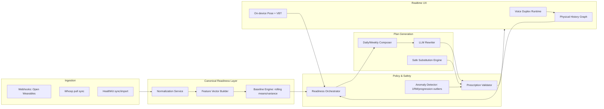

# AskKodaAI SIT Gap Closure Plan (Execution Blueprint)

Date: 2026-03-09  
Input baseline: `docs/reports/sit-gap-audit-2026-03-09.md`

## 1) Program objective and delivery contract

### Objective
Close all critical SIT gaps across five pillars with production-grade controls for safety, personalization, and low-latency coaching.

### Exit criteria (program-level)
- Deterministic, auditable auto-regulation engine mutates day plans without user prompt when risk thresholds are crossed.
- Realtime coaching pipeline supports voice duplex and on-device movement feedback with bounded latency.
- Cross-provider wearable normalization feeds a canonical readiness vector used directly by training mutation policies.
- Hard safety validator blocks unsafe prescriptions pre-persistence and pre-delivery.

### Program timeline (macro)
- **Phase A (Weeks 1-4):** Guardrails + contracts + observability baseline
- **Phase B (Weeks 5-8):** Readiness orchestrator + deterministic auto-regulation
- **Phase C (Weeks 9-14):** Voice/memory state graph + substitution policy
- **Phase D (Weeks 15-22):** Edge CV + VBT + realtime cues
- **Phase E (continuous):** Provider expansion, quality loops, and model governance

---

## 2) Workstream architecture

---

## 3) SIT pillar closure plan

## Pillar 1 — Brain (Algorithmic Programming + Auto-Regulation)

### Build scope
1. **Canonical Readiness Feature Vector v1**
   - Inputs: ACWR, sleep debt, HRV delta from 21-day baseline, resting HR delta, strain score, soreness NLP severity, adherence decay, pain flags, last-session exertion.
   - Output: `readiness_state` (`green|amber|red`) + `confidence` + reason codes.
2. **Readiness Orchestrator**
   - Deterministic policies mutate sets/reps/intensity/rest/density.
   - Policy examples:
     - `RED`: cap RPE at 6, reduce volume 35-50%, force technique variants.
     - `AMBER`: reduce volume 10-20%, preserve movement patterns.
     - `GREEN`: allow progressive overload within validator bounds.
3. **Auto-rewrite hook**
   - Before returning today plan, orchestrator evaluates state and mutates payload.
   - Store `mutation_trace` (JSON) for audit and explainability.

### Data model additions
- `readiness_snapshots` (canonical features + scores + reasons)
- `plan_mutations` (before/after diffs, policy IDs, confidence)
- `policy_versions` (versioned thresholds)

### Testing
- Backtest orchestrator on prior 90-day user timelines.
- Property tests: no negative sets, no missing primary movement categories.
- Regression suite for known fatigue scenarios.

---

## Pillar 2 — Eyes (Low-latency CV)

### Build scope
1. **On-device inference module (iOS-first)**
   - Pose landmarks + temporal smoothing + rep phase segmentation.
   - Target: >24 fps local processing, p95 cue latency <200 ms.
2. **Joint-angle rules engine**
   - Exercise-specific criteria (e.g., pull-up elbow extension/flexion thresholds).
   - Compensatory pattern detection (valgus, lumbar flexion, hip shift).
3. **VBT channel (camera-derived)**
   - Concentric phase velocity estimation with confidence scoring.
   - Fatigue stop trigger when velocity loss threshold exceeds configured %.
4. **Occlusion handling strategy**
   - Confidence-gated cue suppression.
   - Prompt user reposition cues when visibility score drops below threshold.

### Interfaces
- `motion_stream_events` topic (rep, phase, velocity, confidence, fault_code)
- `realtime_cues` stream for voice output and UI overlays

### Validation plan
- Synthetic and recorded benchmark clips across lighting, angle, and occlusion classes.
- Per-lift confusion matrix for cue precision/recall.

---

## Pillar 3 — Voice (Conversational UX + Cognitive Memory)

### Build scope
1. **Realtime duplex stack**
   - Streaming ASR -> incremental LLM -> interruption-safe TTS.
   - Barge-in handling and turn arbitration.
2. **Physical History Graph**
   - Entities: injury episode, symptom recurrence, exercise substitution, outcome quality.
   - Query policy: if symptom recurrence detected, retrieve last successful substitution chain.
3. **Deterministic substitution middleware**
   - Symptom triggers route through safe substitution policy before LLM freeform response.
4. **Exercise Ontology v1**
   - Canonical IDs, aliases, contraindications, equivalence classes, progression ladders.

### Runtime guarantees
- Any symptom recurrence generates a policy check event.
- LLM cannot bypass substitution constraints if contraindication is active.

### Validation plan
- Conversational continuity tests over 30-day simulated dialogue windows.
- Deterministic replay tests for recurrence scenarios.

---

## Pillar 4 — Nervous System (Wearable integration)

### Build scope
1. **Provider normalization service**
   - Canonical schema: sleep, readiness, strain, HRV, RHR, respiration, SpO2, steps, glucose proxies.
   - Source confidence weights per provider and signal quality.
2. **Sync resiliency**
   - Webhook replay queue + nightly reconciliation backfill.
   - Drift monitor: expected vs received daily signal completeness.
3. **Mutation coupling**
   - Readiness vector consumed by orchestrator as hard input, not insight-only context.
4. **Provider expansion path**
   - Add first-class Oura connector using same normalized contract.

### SLOs
- Daily signal completeness >95% for connected users.
- Reconciliation recovers >99% of missing events within 24h.

---

## Pillar 5 — Safety protocols and injury prevention

### Build scope
1. **Prescription Validator (blocking gate)**
   - Hard caps:
     - weekly set delta per pattern,
     - load progression delta per training age,
     - max high-intensity days in rolling window,
     - minimum recovery spacing for high-neural sessions.
2. **1RM anomaly detector**
   - Rules + statistical checks against bodyweight, training age, and trend consistency.
   - Quarantine improbable entries from progression computations.
3. **Clinical red-flag policy graph**
   - Severe symptom intents force escalation and training de-load recommendation.
4. **Safety audit ledger**
   - Immutable event records for blocked/modified outputs and reason codes.

### Governance
- Safety rule changes require version bump and changelog.
- Red-team prompt set run before deploying any policy update.

---

## 4) Sprint-by-sprint execution plan (12 sprints)

| Sprint | Theme | Deliverables | Definition of done |
|---|---|---|---|
| 1 | Contracts | Canonical readiness schema + policy version table + telemetry fields | schema migrated, docs updated, events emitted |
| 2 | Guardrails | Validator MVP with load/volume caps | unsafe test plans blocked in CI fixtures |
| 3 | Anomaly checks | 1RM outlier detector + quarantine | outlier events logged and excluded from progression |
| 4 | Orchestrator foundation | readiness feature builder + reason codes | deterministic policy unit tests passing |
| 5 | Auto-mutation | apply orchestrator to daily plan API | plan responses include mutation trace |
| 6 | Explainability | user-facing adaptation rationale + audit API | rationale visible and trace retrievable |
| 7 | Voice infra | streaming ASR/LLM/TTS pilot | barge-in + interruption tests passing |
| 8 | Memory graph | physical history graph write/read layer | recurrence retrieval integrated in chat flow |
| 9 | Substitution policy | ontology v1 + deterministic substitution middleware | contraindicated lifts blocked automatically |
| 10 | CV runtime | on-device pose loop + rep segmentation prototype | >24fps in benchmark profile |
| 11 | VBT + cues | velocity estimation + realtime cue channel | p95 cue latency <200ms in lab harness |
| 12 | Integration hardening | cross-pillar E2E + reliability tuning | release checklist complete |

---

## 5) Risk register and mitigations

| Risk | Impact | Mitigation |
|---|---|---|
| CV latency exceeds target on older devices | weak realtime coaching UX | dynamic quality tiers, hardware capability detection, cue fallback mode |
| Provider data sparsity | unstable readiness decisions | confidence-weighted features + fallback heuristics |
| Policy brittleness | over-conservative or over-aggressive plans | staged rollout with shadow mode and offline backtests |
| LLM drift in rewrite outputs | unsafe prescriptions | mandatory validator gate and schema-constrained generation |
| Voice UX instability | poor retention | progressive rollout by cohort and kill-switch flags |

---

## 6) Market-facing sequencing (Ladder/Future displacement)

1. **Trust-first launch (Sprints 1-6):** deterministic adaptation + safety proofs (addresses canned plans and inconsistency pain).  
2. **Premium coaching launch (Sprints 7-9):** memory-rich conversational engine with symptom-aware substitutions.  
3. **Category-defining launch (Sprints 10-12):** realtime form intelligence and VBT feedback loop.

This sequence maximizes near-term differentiation while minimizing safety and reputational downside.

---

## 7) KPI framework and target bands

| KPI | Baseline (current) | 90-day target after phase | Owner |
|---|---|---|---|
| Auto-mutated session adoption | TBD | >45% of active training days | Product + ML |
| Unsafe draft block rate | TBD | 100% known unsafe scenarios blocked | Safety |
| Symptom recurrence substitution accuracy | TBD | >90% correct deterministic substitution | AI Platform |
| Realtime cue latency (p95) | N/A | <200 ms supported devices | CV Team |
| D30 adherence (migrated cohort) | TBD | +12 pts vs baseline | Growth + Product |

---

## 8) Immediate next actions (next 10 business days)

1. Finalize readiness canonical schema and policy thresholds workshop.
2. Implement validator MVP behind feature flag in plan APIs.
3. Add `mutation_trace` persistence and telemetry events.
4. Stand up backtesting harness with sampled historical users.
5. Draft ontology v1 seed list from existing exercise corpus.

